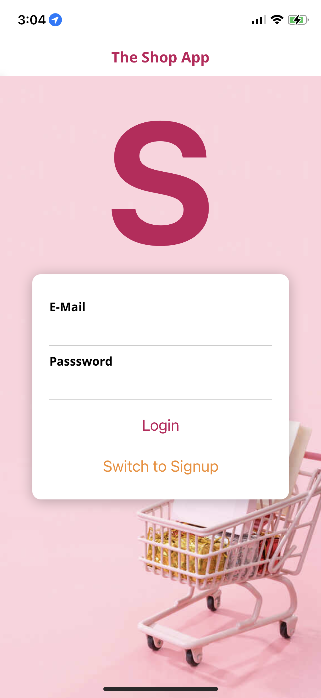
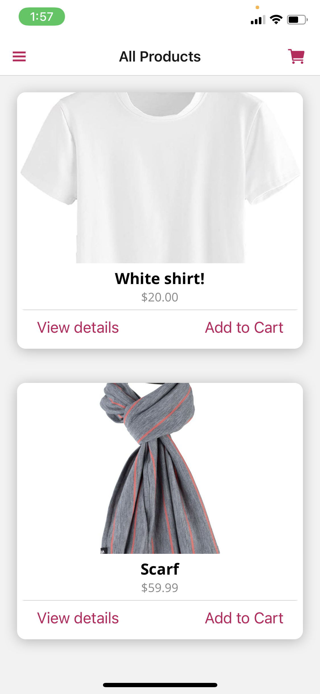
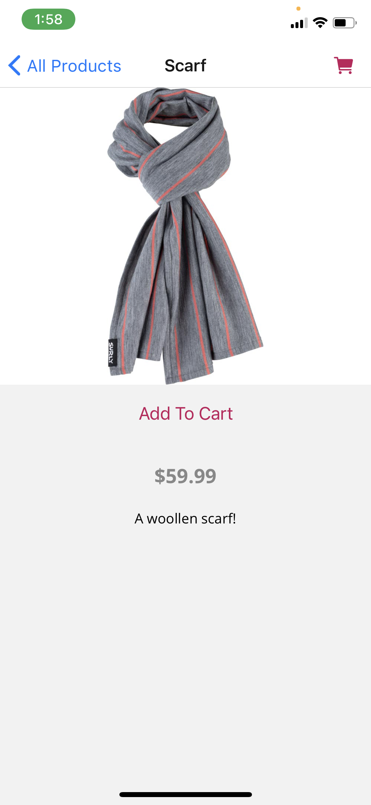
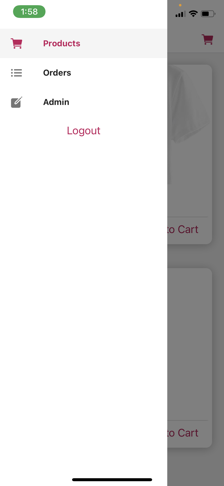
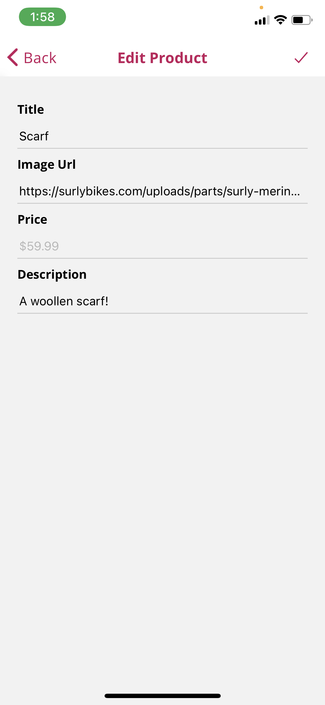
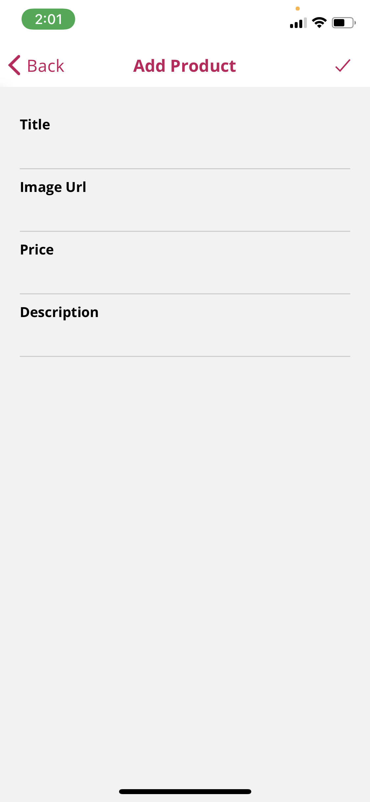
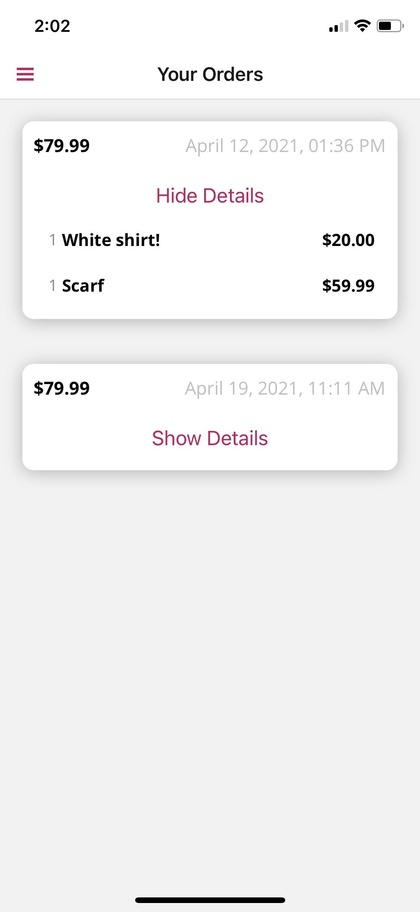
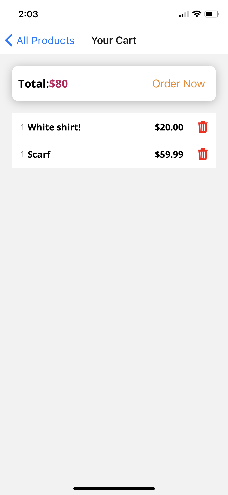

# shopApp

An online shopping app where user can add and edit their own products, and list them on home screen.

# Technologies

* react-native
* firebase
* redux-thunk: "^2.3.0"
* react-navigation: "^4.4.4"
* expo: "~40.0.0"
* @expo/vector-icons: "^12.0.3"

# What I learned

* React drawer/stack navigation.
* Managing state using Redux.
* User authentication using firebase.
* Implemented auto-logout and auto-login.
* Fetching and storing data on firebase firestore.

# Screenshots

